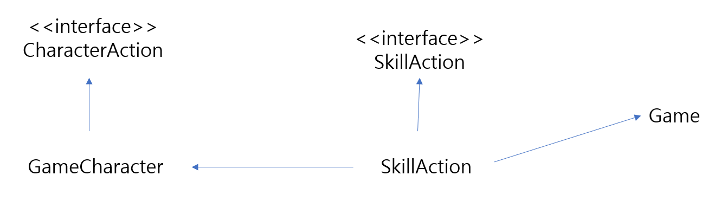

# 턴제 게임
  
## Character  
스킬 초기화  
어택  
방어
스킬 사용  
데미지 계산  
스킬 쿨타임 업데이트  
현재 상태 출력  
이름 get  
체력 get  

## Skill  
스킬 사용 가능 여부  
스킬 사용  
쿨타임 감소  
정보 출력  
마나 값 get    

## Game  
게임 스타트 및 남은 턴 계산해서 게임 종료  
선택한 행동에 따른 체력, 마나, 턴 제한 계산  
